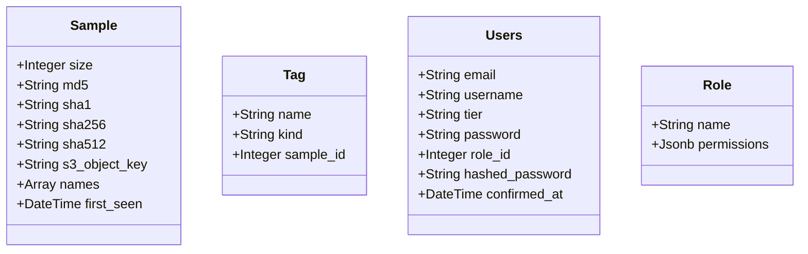

# VxUnderground

## Features

- [LiveView Authentication](https://fly.io/phoenix-files/phx-gen-auth/)
- User Role and Permission system
- Direct to S3/Wasabi upload with LiveView
  - https://hexdocs.pm/phoenix_live_view/uploads-external.html
- Generates presigned urls for secure download
- Calculates file hashes with [`:crypto.hash/2`](https://www.erlang.org/doc/man/crypto.html#hash-2)
- Uploads to [Triage](https://tria.ge/) on upload to Vx Underground via [Oban Job Scheduler](https://hexdocs.pm/oban/Oban.html) and notifies the user of completion with `Phoenix.Channels`.
- Checks for VT Report on load of the `Sample` show page.
- Uses [`libcluster`](https://fly.io/docs/elixir/the-basics/clustering/#adding-libcluster) and [`fly_postgres`](https://hexdocs.pm/fly_postgres/readme.html) for scalability
- Has [CI/CD](https://fly.io/docs/elixir/advanced-guides/github-actions-elixir-ci-cd/) setup and is deployed on Fly.io.
- Searchable tables and Light / Dark mode
- Custom Discord Logger backend

### Built With

- **Postgres** - 14.7.0
- **erlang** - 25.2
- [**Elixir**](https://hexdocs.pm/elixir/Kernel.html) - 1.14.3-otp-25
- [**Phoenix**](https://hexdocs.pm/phoenix/Phoenix.html) - 1.7.2
- [**Phoenix LiveView**](https://hexdocs.pm/phoenix_live_view/Phoenix.LiveView.html) - 0.18.17
- **NodeJS** - 19.3.0
- [**TailwindCSS**](https://tailwindcss.com/docs/installation) - 3.0.23

### Screenshots


## Getting Started

### Prerequisites

1. Install `erlang`, `Elixir`, `NodeJS`, `Postgres`

   1. With homebrew the commands are:

   ```zsh
    brew update
    brew install erlang elixir nodejs postgres
   ```

   2. Or if you prefer `asdf`

   ```zsh
    brew update
    brew install asdf

    asdf plugin-add erlang
    asdf plugin-add elixir
    asdf plugin-add nodejs

    asdf install
   ```

### Installation

1.  Clone this Repo and enter the directory.
2.  Set up the project with the command `mix setup`
3.  Set the following env variables in order to get Wasabi/S3 to work.
    1. `AWS_ACCESS_KEY_ID`
    2. `AWS_SECRET_ACCESS_KEY`
    3. `S3_BUCKET_NAME`
4.  Set the following env variables in order to get Triage / VT to work.
    1.  `VIRUS_TOTAL_API_KEY`
    2.  `TRIAGE_API_KEY`
5.  Set the following env variables in order to get Discord Logging to work. (optional)
    1.  `DISCORD_BOT_TOKEN`
    2.  `DISCORD_CHANNEL_ID`
6.  Start Phoenix server with `iex -S mix phx.server`
    1. Now you can visit [`localhost:4000`](http://localhost:4000) or [`localhost:4001`](https://localhost:4001) from your browser.
7.  Once you register a user, you make it admin by running this in the same window you ran `iex -S mix phx.server` in (yes we run commands in a running server)
    1.  `VxUnderground.Accounts.get_user!(1) |> VxUnderground.Accounts.add_role_to_user("Admin")`

> You can run unit tests with the command `mix test`

### TODO

- Setup Minio for Dev upload / download
- Better file types
- YARA Tags / Tags in general
- API routes

## Database architecture 🗂


